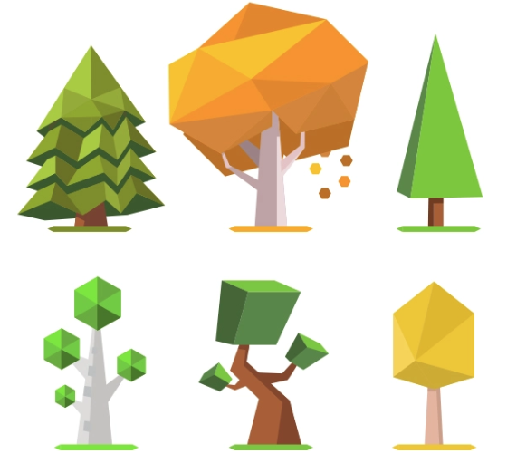
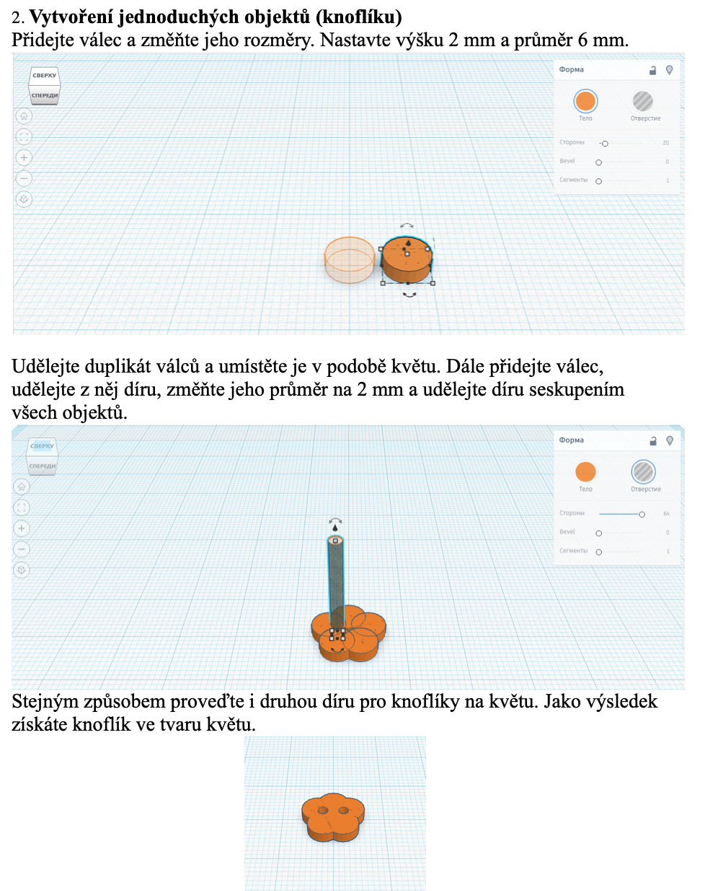

# LEKCE 1
## Co nás čeká
Dnes si povíme o základech 3D modelování. Také si povíme, co je Tinkercad, založíme si účet a vymodelujeme si své první modely. Také si otevřte tento formulář, který budete během lekce vyplňovat https://forms.gle/LmNVsW4jfmrWz1Ak7 . 

## 3D MODELOVÁNÍ
Co znamená zkratka 2D a 3D? Co je podle vás 3D modelování? K čemu je 3D modelování dobré? Kdo všechno musí umět modelovat?

## 3D TISK
Jak to celé funguje?

https://www.youtube.com/watch?v=Vx0Z6LplaMU čas - 0:52 až 1:20

## 3D MODELOVÁNÍ POJMY

1. stínování (shadow mapping)

  
  
2. mapování textur (texture mapping) 

  

  https://www.textures.com/browse/pbr-materials/114558
  
3. perspektivní zkreslení

  

## OSA X, Y, Z

### OSA X, Y - opakování

Osy x a y jsme hojně používali především ve scratchi. K čemu jsou nám dobré? Jaké body jsou vyznačené na obrázku?

### K čemu je nám osa Z?
Díky osám x a y jsme schopni reprezentovat pouze 2D data - tedy znázornit pouze nějaké plochy s výplní. Stejně jako jsme se od jednoduché číselné osy, na které jsme mohli zobrazit pouze body, dostali k systému dvou os - x a y, nyní potřebujeme přidat další osu, abychom měli 3D svět. Tuto osu nazýváme osa Z.

Nyní si představte, že obrazovka/displej vašeho počítače je jako okénko ve scratchi, tedy má svou osu X a svou osu Y. Také má svůj střed. Všechny body, které jsou před obrazovkou mají kladné Z (tedy například vy máte souřadnici Z třeba +10), všechno, co je za obrazovkou má zápornou hodnotu Z (tedy např. zeď, která je za vaším počítačem má hodnotu -10).

Pokud bychom to chtěli zakreslit, osy by vypadaly takto. 

Podle os se dá také v prostoru otáčet, což bueme využívat, když se na model budeme dívat z různých úhlů. Opakování - co je to úhel? Co to znamená otočit něco o 90°, 180°, 360°?

## Skládání objektů

V TINKERCADU se objekty tvoří tak, že je skládáme z jednoduchých obrazců, případně do nich pomocí nich děláme tzv. "díry". Nejprve si zopakujeme pár pojmů a zamyslíme se, jak bychom některé objekty poskládali.

Pojmenuj objekty na obrázku

Z jakých objektů se obrazec skládá?

## TINKERCAD

Nyní se již přesuneme k samotnému 3D modelování. Začneme pracovat v softwaru TINKERCAD. Není třeba jej stahovat ani se registrovat, budete přihlášeni do třídy, ke které vám dám přístup.

Pokud by vás 3D modelování bavilo, jeho využití je velmi hojné (automobilový průmysl, počítačové hry, atd.) a můžete se dále učit v náročnějších a profesionálnějších nástrojích jako je Blender, Rhinoceros nebo Maya. 

V Tinkercadu máme již založenou třídu, do které se musíte přihlásit pod danou přezdívkou. Tuto přezdívku byste měli mít na svých emailech, pokud ne, nyní je čas mi to oznámit.

Založíte si nový projekt, ve kterém si ukážeme, jak TINKERCAD funguje.

STREAM

ÚKOL

