# LEKCE 2 - TINKERCAD

## CO NÁS ČEKÁ

Dnes si nejprve zopakujeme, co jsme si říkali minule a také co jsme minule stihli. Zkontrolujeme si domácí úkoly a práce z minula. Poté budeme pokračovat ve 3D modelování a vymodelujeme si pizzu. 

## OPAKOVÁNÍ

Co jsme dělali na minulé hodině? K čemu je to dobré? Jaké osy používáme ve 3D prostoru? Jaké znáte programy pro 3D modelování? Jak se přihlásím na TINKERCAD? Když budu chtít udělat model jednoduchého klíče pro dveře, jak bych to v TINKERCADU udělala?

## KONTROLA DÚ

Byl úkol jednoduchý? S čím byl případně problém při vypracování?

## DNEŠNÍ TÉMA - modelujeme pizzu

Na první lekci jsme si vyzkoušeli vytvořit různé jednoduché objekty. Nebylo by špatné pokračovat s tím, co máme všichni určitě rádi - jídlo. Proč bychom tedy nemohli vymodelovat pizzu? Pusťme se do toho.
Podívejte se na tento obrázek, jak byste při modelování postupovali? Čím začít?

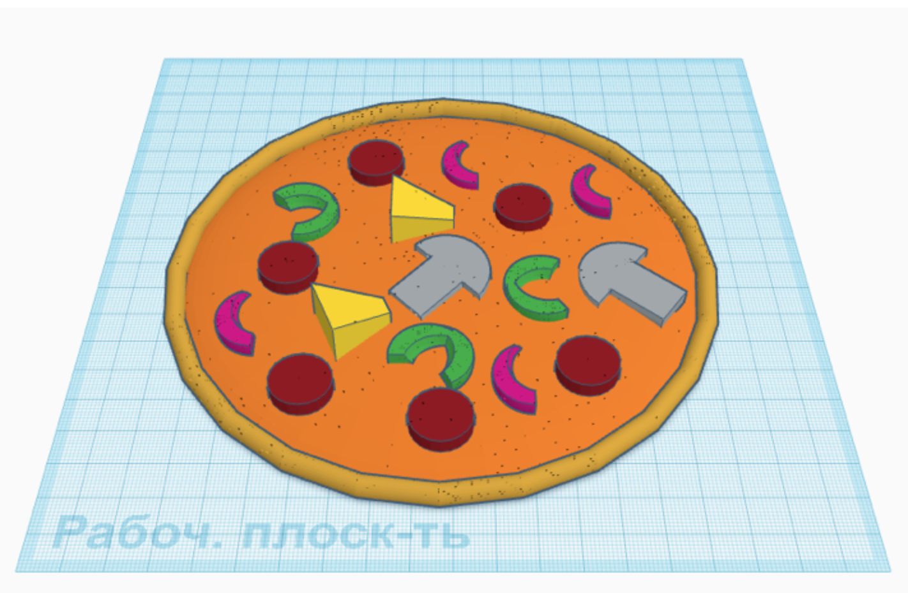

Nejprve si vymodelujeme ingredience pro vytvoření náplně pro naši pizzu. Budou to: salám, houby, ananas, cibule, paprika. Nezačínáme "těstem", protože by nám na pracovní ploše mohlo překážet.

### ZAČÍNÁME MODELOVAT 
Vytvořte plátek salámu.
Vyberte válec, změňte jeho výšku na 4 mm, průměr na 16 mm. Potom ho obarvěte na tmavočervenou barvu.

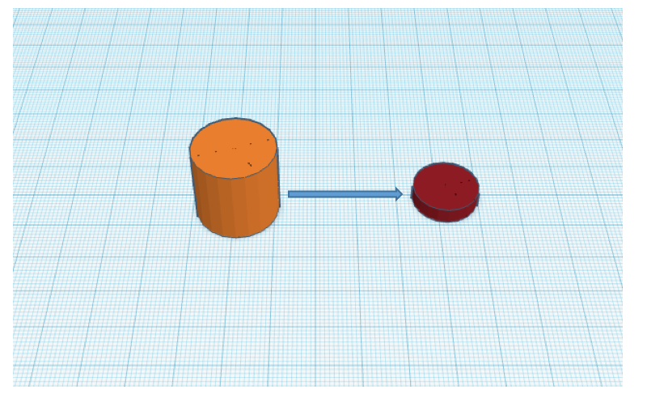

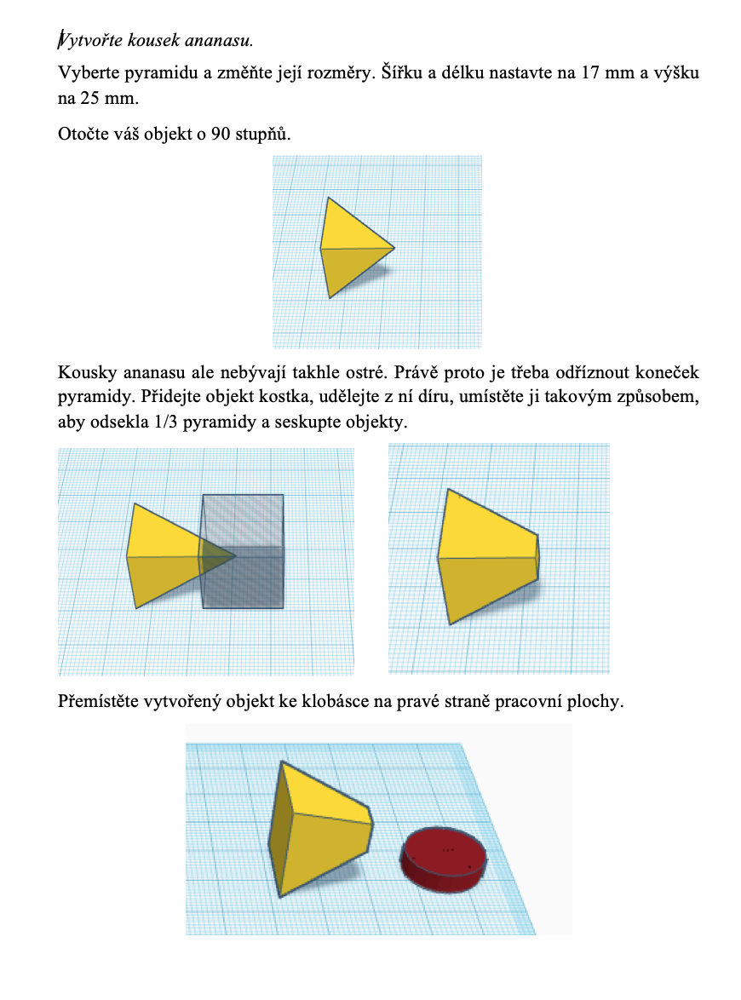

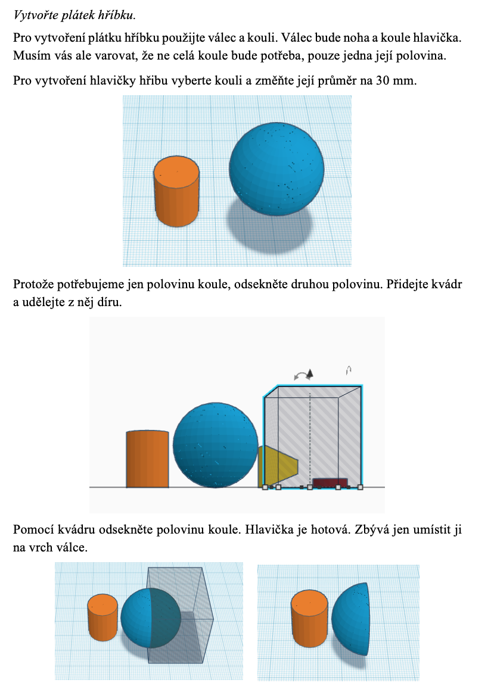

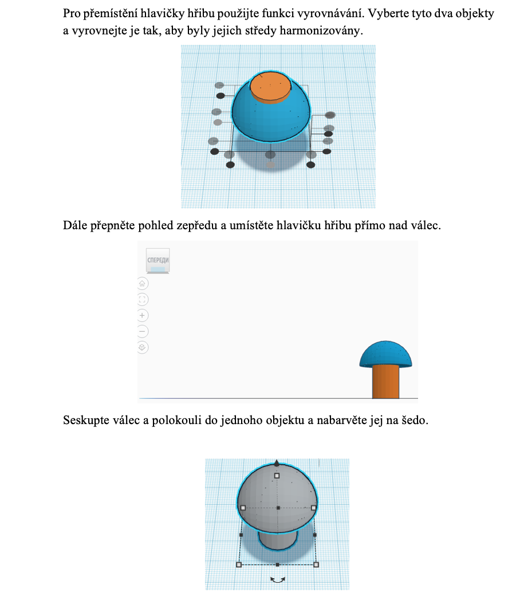

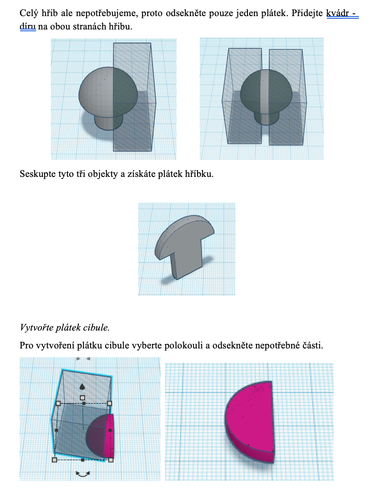

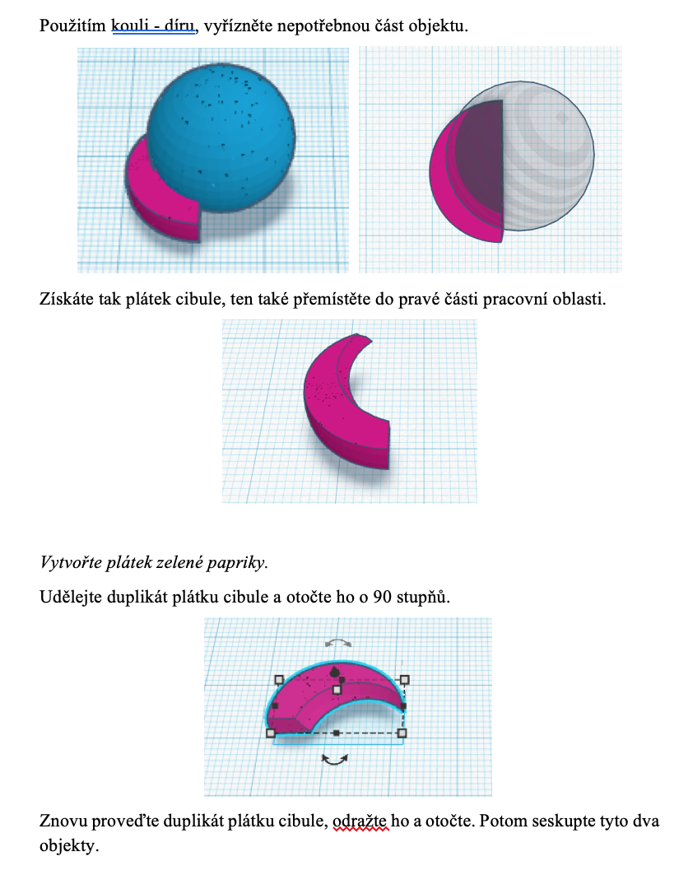

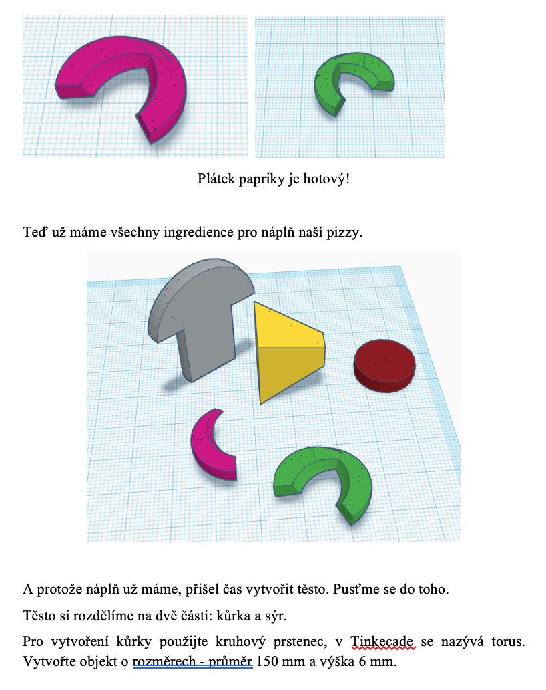

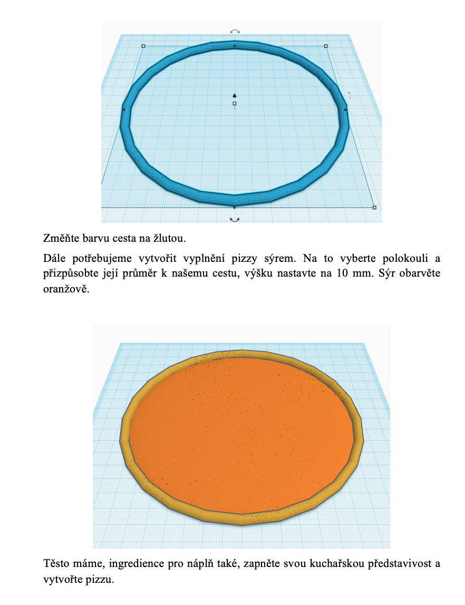

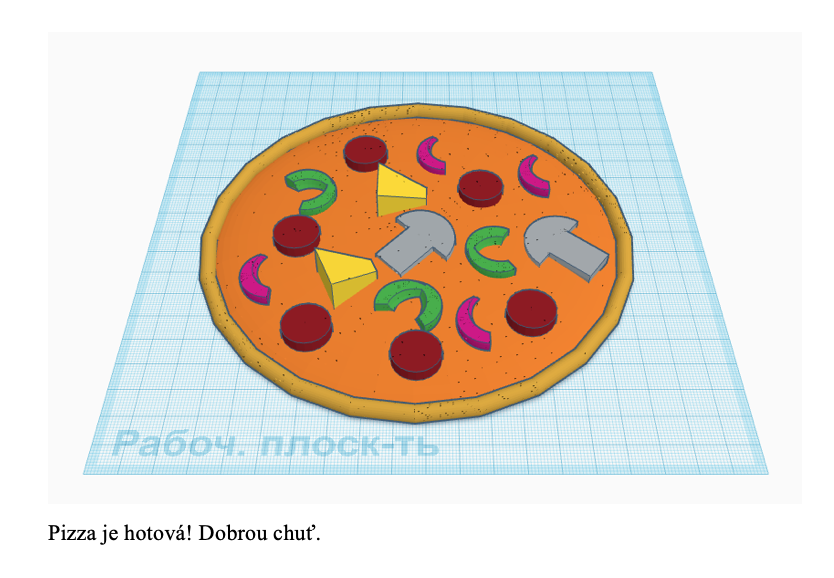

## DOMÁCÍ ÚKOL

Do příště si vypracujte jiný pokrm, hamburger s hranolkami. 

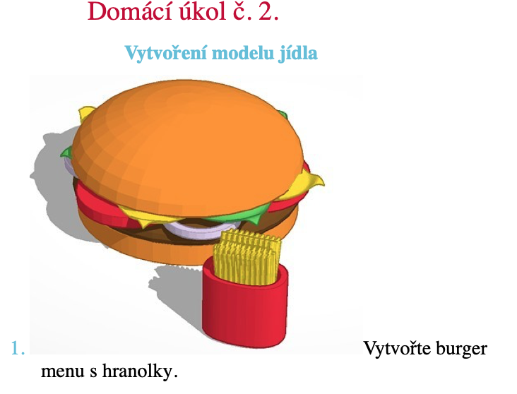
