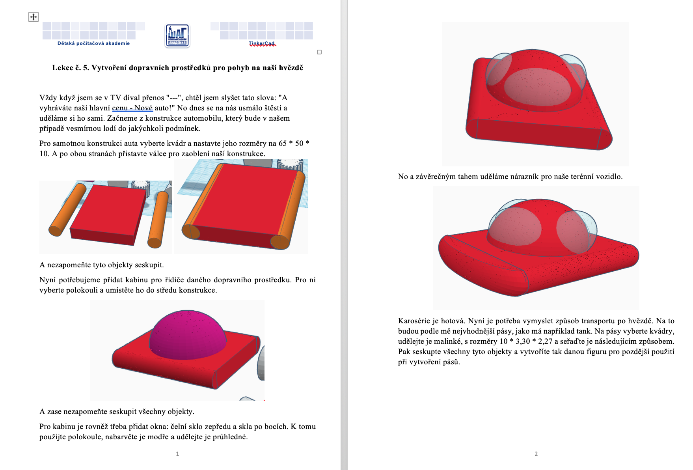
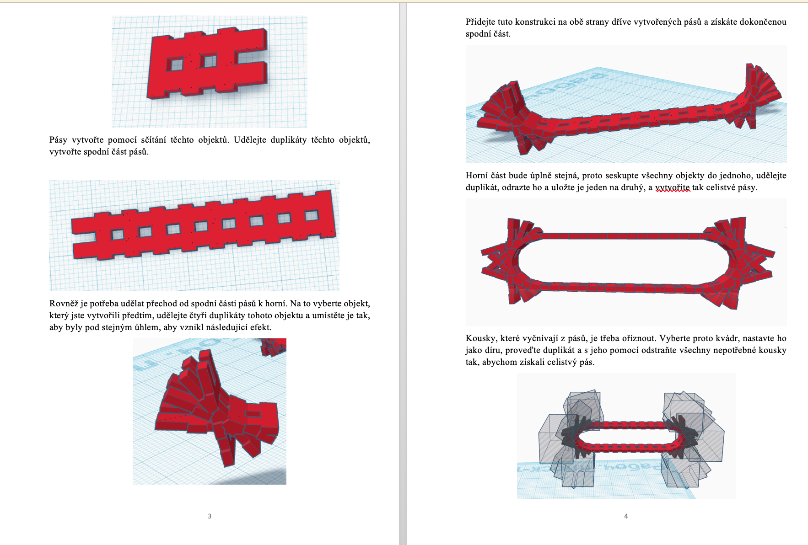
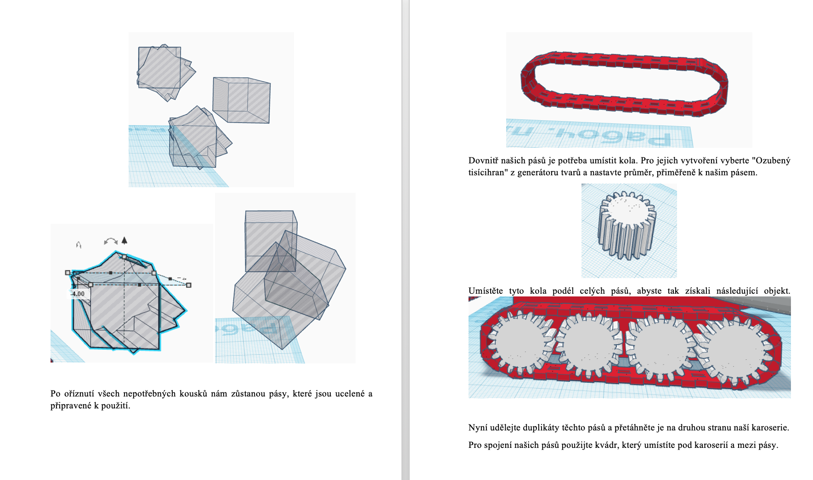
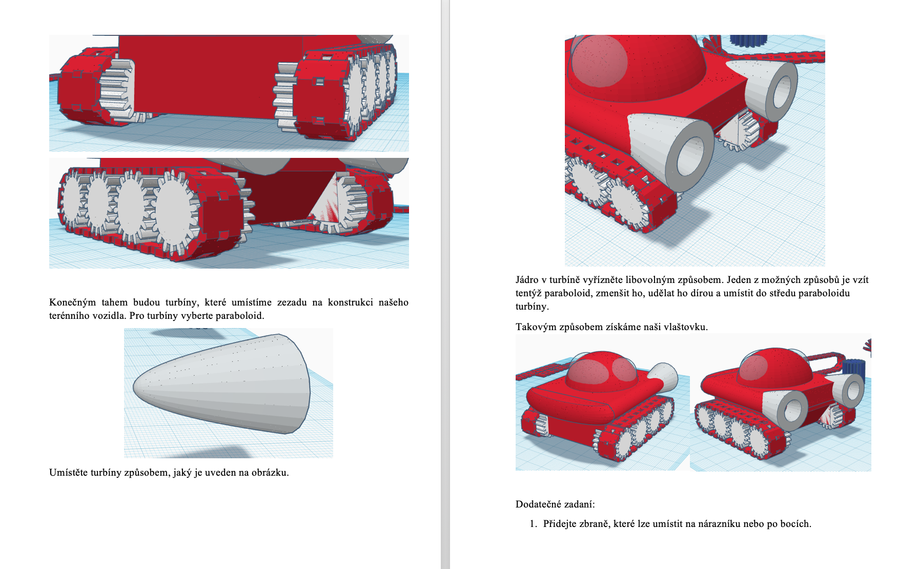

# LEKCE 3

Kdo nestihl v předchozí lekci vymodelovat dům, bude dneska pokračovat v modelování domu. Kdo má dům již hotový, přidá si dovnitř libovolné vybavení. 
Dále si dle návodu vytvořte dopravní prostředek.

