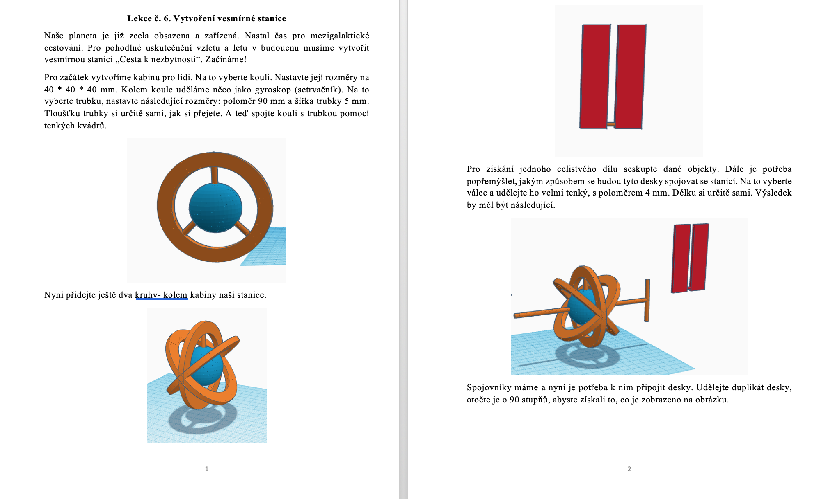
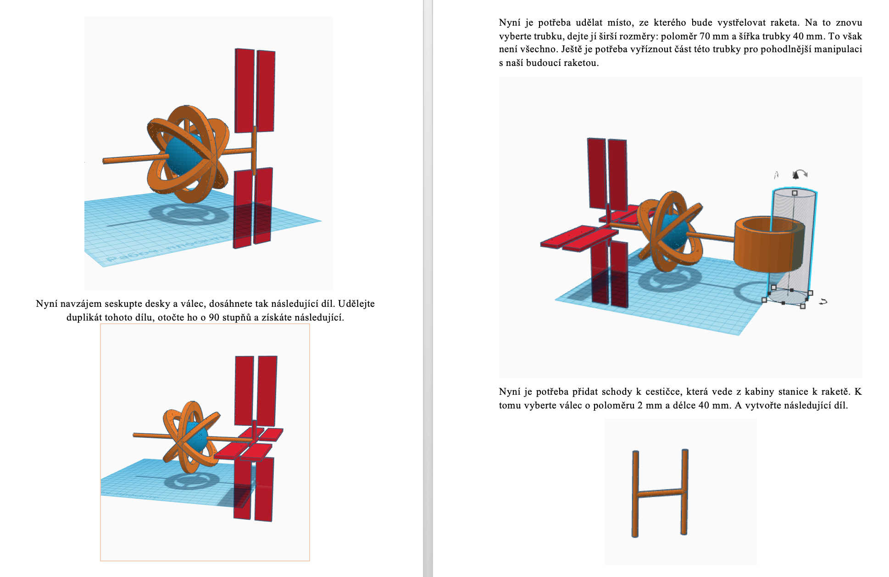
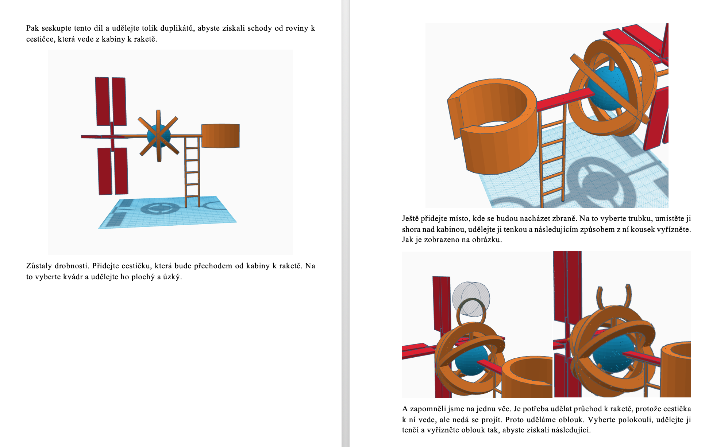
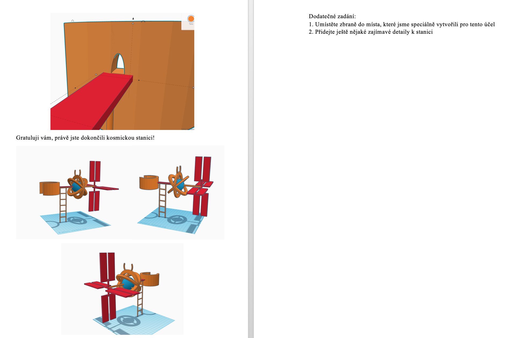

# LEKCE 3

Dominik - dodělat hamburger, začít barák
Míra - nábytek
Denys - dodělat barák 
ONdra - stejné jako Míra
Matyáš - začít barák
Andrej - dům

Kdo nestihl v předchozí lekci vymodelovat dům, bude dneska pokračovat v modelování domu. Kdo má dům již hotový, přidá si dovnitř libovolné vybavení. 
Dále si dle návodu vytvořte dopravní prostředek nebo vesmírnou stanici.

## Dopravní prostředek

## Vesmírná stanice

